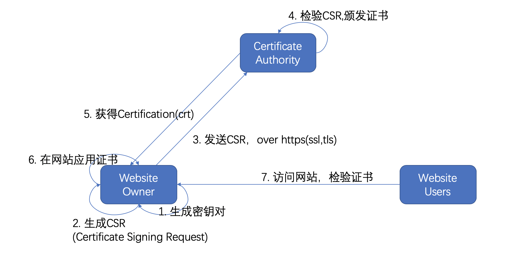

# 加密，签名与证书

## 加密与解密
数据在存储过程中(data at rest)，传输过程中(data in motion)，使用过程中(data in use/memory)，都有可能意外的泄漏，这就要求数据要进行加密。
所谓加密就是把数据按照一定的规则或者算法进行变形，这样即使数据泄漏了也无法得到真正的内容，典型的用例就是军事上的密电。

很久以前人们就认识和使用到了加密的算法，只是都比较原始，后来随着计算机和数学的发展，加密算法越来越健壮，也越来越规范，那么使用一种加密算法的数据，会不会被使用同一种算法的其他人解密呢？当然不会，原因就是他们有不同的密钥。所以密码学里面最重要的两个概念就是加密算法和密钥。密码学的研究大部分是围绕这两个概念在进行。现代计算机里面用到的最多的两种加密算法：对称加密和非对称加密

### 对称加密 vs 非对称加密
所谓对称加密是指加密的密钥和解密的密钥是一样的。
而非对称加密是需要一个密钥对，留在自己手上来解密的称为私钥，发送给别人用来加密的称为公钥，加密算法和密钥的产生保证了无法从公钥来破解出私钥，当然，这个是说基于现有已知技术和一在定的时间内，比如1万年，这也是为什么我们需要定期更换密钥的原因，给了足够长的时间，任何密钥都是能破解的。

对称加密经常用在 Data at rest， Data in use/memory， 比如磁盘加密，内存加密。
而非对称加密一般用在 Data in motion，就是数据传输的过程中，这是因为数据在传输的过程中一般需要几个参与方，而各个参与方只持有对方的公钥才能保证安全。

### DES， 3DES and AES
常用的对称加密算法有 DES，3DES和AES，已经证明DES不再安全，所以推荐使用AES，至少是3DES。

### MD5，SHA1， SHA2， SHA256...
非对称加密以SHA加密组为最主要的加密算法。
非对称加密中，用来加密的key是公钥，用来解密的key是私钥。
这些加密算法都可以用 `opengpg` 这个工具来实现

比如一个简单的加密的命令：
`gpg -e file`

我们也可以加一些参数来指定用于加密的key，也可以不指定参数用gpg 钥匙串中(keyring)默认的key。

解密的命令类似：
比如一个简单的加密的命令：
`gpg -d file`

### 同太加密（Homomorphic encryption）
随着云计算的普及，最近有一种新的加密算法正在被越来越多的企业和机构所关注，这就是同太加密。
同太加密的概念是这样的，数据在加密以后还可以进行运算，比如加减乘除，加密数据运算后的结果当然还是加密的状态，对于运算执行着来说这些数据是没有意义的，运算的执行者就是云计算厂商。但是这些运算过的结果返回给客户以后，客户可以把它再解密，还原结果，这个结果跟没加密的数据执行相同的运算的结果是一样的。也就是说，云计算厂商只是提供运算能力，对它操作的数据一无所知。

## 签名及验证
说完加密，咱们再来看看签名。生活中我们用到签名的地方一般是要证明一种身份，这个身份得到证明的时候，我就可以信任他。所以签名实际上是一种信任关系。
数字签名是类似的，经过签名的数据跟加过密的数据不一样，它是公开可见的，只是，你可以用工具来验证，是谁产生的这些数据。

签名过程中，用来做签名的key是私钥，用来验证签名的key是公钥。

签名的命令：
`gpg -s file`

验证签名的命令跟解密是一样的：
`gpg -d file`

附录，详细的gpg命令参数：
```
$ gpg --help
gpg (GnuPG) 2.2.16
libgcrypt 1.8.4
Copyright (C) 2019 Free Software Foundation, Inc.
License GPLv3+: GNU GPL version 3 or later <https://gnu.org/licenses/gpl.html>
This is free software: you are free to change and redistribute it.
There is NO WARRANTY, to the extent permitted by law.

Home: /Users/huoqifeng/.gnupg
支持的算法：
公钥： RSA, ELG, DSA, ECDH, ECDSA, EDDSA
密文： IDEA, 3DES, CAST5, BLOWFISH, AES, AES192, AES256, TWOFISH,
    CAMELLIA128, CAMELLIA192, CAMELLIA256
散列： SHA1, RIPEMD160, SHA256, SHA384, SHA512, SHA224
压缩：  不压缩, ZIP, ZLIB, BZIP2

语法：gpg [options] [files]
签名、检查、加密或解密
默认的操作依输入数据而定

命令：

 -s, --sign                  生成一份签名
     --clear-sign            生成一份明文签名
 -b, --detach-sign           生成一份分离的签名
 -e, --encrypt               加密数据
 -c, --symmetric             仅使用对称密文加密
 -d, --decrypt               解密数据（默认）
     --verify                验证签名
 -k, --list-keys             列出密钥
     --list-signatures       列出密钥和签名
     --check-signatures      列出并检查密钥签名
     --fingerprint           列出密钥和指纹
 -K, --list-secret-keys      列出私钥
     --generate-key          生成一个新的密钥对
     --quick-generate-key    快速生成一个新的密钥对
     --quick-add-uid         快速添加一个新的用户标识
     --quick-revoke-uid      快速吊销一个用户标识
     --quick-set-expire      快速设置一个过期日期
     --full-generate-key     完整功能的密钥对生成
     --generate-revocation   生成一份吊销证书
     --delete-keys           从公钥钥匙环里删除密钥
     --delete-secret-keys    从私钥钥匙环里删除密钥
     --quick-sign-key        快速签名一个密钥
     --quick-lsign-key       快速本地签名一个密钥
     --sign-key              签名一个密钥
     --lsign-key             本地签名一个密钥
     --edit-key              签名或编辑一个密钥
     --change-passphrase     更改密码
     --export                导出密钥
     --send-keys             个密钥导出到一个公钥服务器上
     --receive-keys          从公钥服务器上导入密钥
     --search-keys           在公钥服务器上搜索密钥
     --refresh-keys          从公钥服务器更新所有密钥
     --import                导入/合并密钥
     --card-status           打印卡片状态
     --edit-card             更改卡片上的数据
     --change-pin            更改卡片的 PIN
     --update-trustdb        更新信任数据库
     --print-md              打印消息摘要
     --server                以服务器模式运行
     --tofu-policy VALUE     设置一个密钥的 TOFU 政策

选项：

 -a, --armor                 创建 ASCII 字符封装的输出
 -r, --recipient USER-ID     为 USER-ID 加密
 -u, --local-user USER-ID    使用 USER-ID 来签名或者解密
 -z N                        设置压缩等级为 N （0 为禁用）
     --textmode              使用规范的文本模式
 -o, --output FILE           写输出到 FILE
 -v, --verbose               详细模式
 -n, --dry-run               不做任何更改
 -i, --interactive           覆盖前提示
     --openpgp               使用严格的 OpenPGP 行为

（请参考手册页以获得所有命令和选项的完整列表）

例子：

 -se -r Bob [file]          为用户 Bob 签名和加密
 --clear-sign [file]        创建一个明文签名
 --detach-sign [file]       创建一个分离签名
 --list-keys [names]        列出密钥
 --fingerprint [names]      显示指纹
```

所以签名是为了建立信任关系，但是在计算机世界中要建立信任的关系，还要稍微复杂一点点。

在计算机世界中信任一般有两层含义：社交上的信任，技术上的信任。
社交上的信任跟我们日常生活中的信任是一样的，比如，Google， IBM， Microsoft口碑比较好，我们信任他们，签名解决的就是社交上的信任。
那么什么是技术上的信任呢？除了上面讲到的签名以外，还需要一个东西，叫证书。


## 证书那些事

我们先来看一看证书使用的一个使用流程



先来了解一下各个角色和流程：

### 角色

- Website Owner
网站拥有者，负责维护提供网站，维护网站

- Website Users
网站使用者，最终用户，大部分时间指的就是我们自己

- Certificate Authority (CA)
证书颁发机构，一般是有很大公信力的公司或者政府组织。理论上可以有很多，实际上也不少，但是真正得到各大浏览器厂商支持的基本就一个，原因大家可以自己搜。那么，我们不用CA，自己给自己颁发一个证书可不可以呢？当然可以，但是主流的浏览器厂商可能不认，结果就是会在访问持有这个证书的网站的时候浏览器会警告。

### 流程

- 网站拥有者生产自己的密钥

- 网站拥有者生产CSR

- 网站拥有者发送CSR给CA

- CA颁发证书

- CA把证书返回给网站拥有者

- 网站拥有者在自己的网站使用证书

- 网站使用者访问网站并验证证书

接下来我们来详细解释这些步骤：

### 生成密钥
我们这里说的密钥指的是非对称加密的密钥对，分为公钥和私钥，上面解释过了，在生成密钥以及后续步骤的一系列文件的时候我们都会用到一个著名的工具`openssl`， 用`openssl`生成密钥的命令：

生成私钥：
`openssl genrsa -out privatekey.key 4096`

生成公钥：
`openssl rsa -pubout -in privatekey.key -out publickey.key`

这里，4096是密钥的位数，可以是，256，512，1024，2048，4096位数越长，被破解的风险越低。相应的，加密解密所耗费的时间也越长。
生成的key的后缀是   `*.key`，有的同学可能看到有些guide给的后缀是`*.pem`。这个都不要紧，需要指出的是`pem`是编码格式，也就是生成的key是以`pem`这种编码格式存储的。与之对应的是另外一种编码格式`der`

- pem (Privacy Enhanced Mail, BASE64 encoding)
  base64 编码的文本
- der (Distinguished Encoding Rules, Binary)
  二进制

当然，在生成私钥和公钥的时候还有很多其他的参数，这里只是给一个简单的例子。

### 生成CSR (Certificate Signing Request)

生成CSR的命令：
`openssl req -nodes -newkey rsa:2048 -sha256 -keyout my.domain.key -out my.domain.csr`

只是一个示例。更多的参数可以参考`openssl`的帮助，需要注意的是CSR和CA都是跟域名相关联的。

那么我们为什么需要CSR呢？CA直接给我们颁发一个证书不更方便吗？
原因是这样的，要获得一个组织的身份，从私钥中获得当然是最准确和直接的，但是你不能把它发给CA啊。所以你要把这些信息放在一个请求文件里面，这就是CSR，CSR里面包含的就是这些组织信息，还有你的公钥。

### 发送CSR给CA

CSR生成以后，就可以发送给CA了，这里面没有太多好说得，一般都是网站上传，基于https，https是http over ssl|tls。ssl和tls是tcl层实现传输层安全的协议。基本上tls可以看作ssl的升级，因为一些安全性问题，ssl已经不再使用了，推荐的是tls1.2或更高，但是为了表达的方便，我们有时候还是会说基于ssl。

### CA颁发证书（crt）

CA收到CSR之后会验证信息的有效性，顺便提一下，这个验证工作和后面的责任是CA费用昂贵的部分原因。然后用CA的私钥给这个Website owner的公钥签名。注意：

- 给什么签名？
  发过来的website owner的公钥。
- 用什么签名？
  用CA的私钥

这个生成的证书一般是一个 `.crt` 文件， 这个文件符合x.509规范，什么是 `x.509`?
> X.509 certificates are used to help users identify a secure connection and  X.509 certificates create a key pair in order to bind a specific user to a certificate, ensuring privacy and legitimacy for users within companies or larger organizations. When a certificate creates a pairing, it also verifies the identity of the user it’s linking to. This two-pronged approach ideally works to make connections and sites more secure and less prone to Phishing attacks.
An X.509 certificate will always come with the following:
A DN, or distinguished name, used to verify the identity of the user.
A public key to tie to that user
Information about the version of X.509 used by the certificate
A serial number
An issuer DN linking to the original purchaser of the certificate
A digital signature
Details about the certificate’s algorithm
Optional extensions for enhanced security

同样的，存储格式可以是`pem`，也可以是`der`。

我们有时候也看到`pfs`后缀的文件（(predecessor of PKCS#12)），这个是为什么呢？
一般情况下，比如Linux上，`crt`和`.key`是分开存放的，但是在windows上有些服务比如IIS要求这两个文件放在一起，这个就是`pfx`,有很多工具可以把这些文件和格式转换成需要的形式。

我们有时候也会看到一些`.p12`和`.jks`结尾的文件，这个又是什么鬼？

> PKCS#12 （Public-Key Cryptography Standards）， defines an archive-file format for storing server certificates, intermediate certificate if any, and private key into a single encryptable file.

> .jks (Java Key Storage)


- root certificates and intermediate certificate

因为私钥太重要了，所以CA在签证书的时候一般都不会用最原始的私钥，而是先签一系列的子子孙孙私钥，再用这些签过的子子孙孙的私钥签别人的证书，以保证私钥的安全性。

> What is an intermediate certificate? As stated above, Certificate Authorities do not issue server/leaf certificates (end user SSL certificates) directly off of their roots. Those roots are too valuable and there’s just too much risk. So, to insulate themselves, CAs generally issue what is called an intermediate root. The CA signs the intermediate root with its private key, which makes it trusted. Then the CA uses the intermediate certificate’s private key to sign and issue end user SSL certificates. This process can play out several times, where an intermediate root signs another intermediate and then a CA uses that to sign certificate. These links, from root to intermediate to leaf – are the certificate chain.

### CA把证书发送给网站拥有者

这时候证书就可以返回给网站建设者了。

### 在网站使用证书

在网站上使用这些证书，我们以nginx为例子：
```
HTTPS server

server {
 listen  443 ssl;
 server_name my.domain;
 ssl_certificate  my_cert.crt;
 ssl_certificate_key my_private_key.key;
 ssl_session_cache shared:SSL:1m;
 ssl_session_timeout 5m;
 ssl_ciphers HIGH:!aNULL:!MD5;
 ssl_prefer_server_ciphers on;
 location / {
  root html;
  index index.html index.htm;
 }
}
```
这个例子中，`my_cert.crt` 和 `my_private_key.key`就是证书和私钥。

### 访问网站验证证书

最后，用户在访问网站的时候，浏览器做的第一件事就是下载和验证这个CRT，这是因为CRT是CA签过的，而主流的浏览器都内置了主流CA的公钥。

## 引用
https://www.thesslstore.com/blog/root-certificates-intermediate/

https://www.thesslstore.com/blog/root-certificates-intermediate/

https://en.wikipedia.org/wiki/X.509